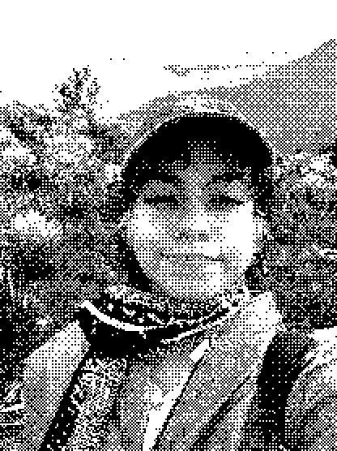

::: {.mac-window}

::: {.mac-titlebar}
[Welcome]{.mac-titlebar-span}
:::

::: {.mac-content}
::: {#profile-header}

::: {#profile-photo}

:::

::: {#profile-info}
## Andrea J. Parra A.
[](https://github.com/andpgate)
[](mailto:andrea2269119@correo.uis.edu.co)
[](https://scholar.google.com/citations?hl=es&user=hTslbmcAAAAJ&view_op=list_works)

Computer Science graduate from Universidad Industrial de Santander (UIS), Colombia. Currently pursuing an M.Sc. in Computer Science at the same university and a member of the Hands-on Computer Vision research group. My interests include Natural Language Processing, Deep Learning, and Computer Vision. When I'm not doing research, I'm probably exploring something else.

:::
:::
:::

::: {.mac-footer}
::: {.mac-icon}
:::
:::

:::

::: {.mac-window}
::: {.mac-titlebar}
[Highlights]{.mac-titlebar-span}
:::
::: {.mac-content}

[PAPERS]{.highlight-section-label}

::: {.highlight-row}
{.highlight-icon-link target="_blank"}

[**Preserving Identity in Speech: Anonymized Transcription for the Colombian Context**]{.highlight-title}\
[*Procesamiento del Lenguaje Natural, Revista nº 76* · 2026]{.highlight-meta}
:::

[AWARDS]{.highlight-section-label}

::: {.highlight-row}
{.highlight-icon-link target="_blank"}

[**Tercer mejor Corpus con HoCV-COL**]{.highlight-title}\
[Hackathon SomosNLP · 2025]{.highlight-meta}
:::

[OTHERS]{.highlight-section-label}

::: {.highlight-row}
{.highlight-icon-link target="_blank"}

[**Encuentro Nacional Orquídeas: Mujeres en la Ciencia**]{.highlight-title}\
[ MinCiencias · 2025, 2026]{.highlight-meta}
:::

:::
::: {.mac-footer}
::: {.mac-icon}
:::
:::
:::

